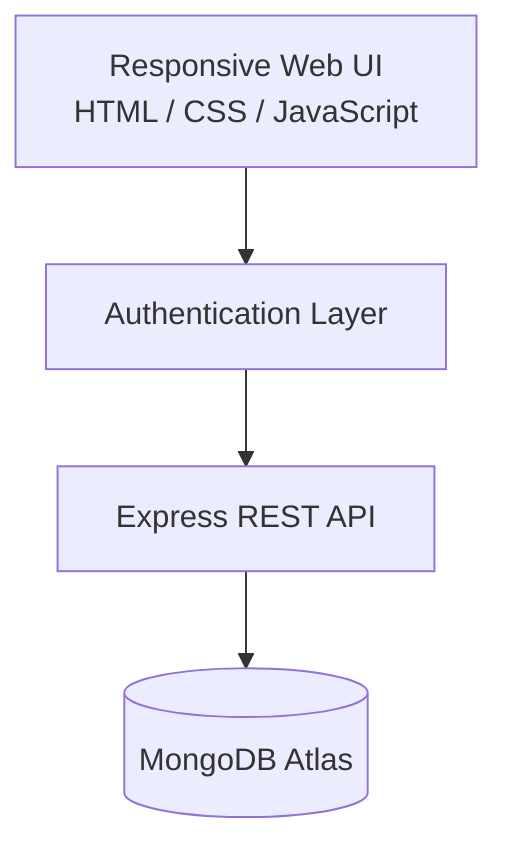

# 📝 NoteIT

[](https://nodejs.org/)
[](https://expressjs.com/)
[](https://www.mongodb.com/)
[](https://developer.mozilla.org/docs/Web/JavaScript)
[](https://opensource.org/license/isc-license-txt)

NoteIT is a secure, modern, and thoughtfully designed note-taking platform built for users who want a fast, reliable, and private way to capture and organize ideas. This repository contains the web and backend experience behind the NoteIT ecosystem, combining a polished frontend with a robust Node.js and Express server powered by MongoDB Atlas.

Whether you are journaling, managing tasks, saving research, or collaborating on shared knowledge, NoteIT delivers a clean and dependable experience across devices.

- Live site: https://noteit.co.in
- Repository: https://github.com/ganeshsharma-dev/NoteIT

---

## 📖 About

NoteIT is designed to make personal knowledge management feel effortless. The platform combines a lightweight, responsive web experience with a secure backend to support note creation, organization, sharing, and long-term access from anywhere.

Built with modern web technologies and a focus on reliability, the application emphasizes secure authentication, protected data handling, and a smooth user experience for both everyday productivity and larger knowledge workflows.

---

## ✨ Features

- Secure user registration and login
- Password recovery through email-based flow
- Create, edit, and delete notes with ease
- Mark notes as favorites for quick access
- Share notes securely with other users
- View and manage shared notes in one place
- Update profile information and manage account settings
- Protect sensitive account actions with hashed credentials
- Enjoy a responsive and polished web experience

---

## 🌐 Live Demo

- Website: https://noteit.co.in
- Web app: https://noteit.co.in/notelist.html

---

## 🏗 Architecture



The project follows a clean layered architecture designed for maintainability and scalability:

- Frontend: delivers the interactive web experience and user interfaces
- Routes: manage authentication, note operations, sharing, and user account actions
- Models: define the core data structures for users, notes, and shared records
- Database: persists application data securely in MongoDB Atlas

---

## 🛠 Tech Stack

### Frontend

- HTML5
- CSS3
- JavaScript

### Backend

- Node.js
- Express.js

### Database

- MongoDB Atlas
- Mongoose

### Authentication & Utilities

- bcryptjs
- dotenv
- nodemailer
- cors
- body-parser

---

## 📂 Project Structure

```text
public/
routes/
models/
utils/
authDB/
server.js
package.json
README.md
```

---

## 🚀 Getting Started

### 1. Clone the repository

```bash
git clone https://github.com/ganeshsharma-dev/NoteIT.git
cd NoteIT
```

### 2. Install dependencies

```bash
npm install
```

### 3. Configure environment variables

Create a `.env` file in the project root.

### 4. Start the server

```bash
npm start
```

---

## 🔐 Environment Variables

Create a `.env` file with values similar to the following:

```env
PORT=5000
MONGO_ATLAS=your_mongodb_connection_string
EMAIL_USER=your_email_address
EMAIL_PASS=your_email_password
```

> Keep credentials private and never commit secrets to version control.

---

## 📡 API Overview

| Method | Endpoint | Description |
| --- | --- | --- |
| POST | `/register` | Register a new user account. |
| POST | `/login` | Authenticate a user and return account details. |
| POST | `/forgot-password` | Send a temporary password to the user's email. |
| POST | `/update-profile` | Update a user's profile data. |
| POST | `/delete-account` | Delete a user account after password verification. |
| POST | `/help-support` | Submit a support request. |
| POST | `/api/notes` | Create a new note. |
| GET | `/api/notes/user/:userId` | Fetch all notes for a specific user. |
| PUT | `/api/notes/:userId/:noteId` | Update an existing note. |
| DELETE | `/api/notes/:userId/:noteId` | Delete a note. |
| PATCH | `/api/notes/:userId/:noteId/favorite` | Toggle favorite status. |
| GET | `/api/notes/:userId/favorites` | Fetch favorite notes. |
| GET | `/api/notes/user/shared-notes/:userId` | Get shared notes for a user. |
| POST | `/api/notes/share-note` | Share a note with another user. |
| DELETE | `/api/notes/revoke-share/:shareId/:ownerId` | Revoke note sharing. |

---

## 🔒 Security

This project includes several security considerations:

- Password hashing with bcrypt
- Protected account and note endpoints
- Environment-based configuration for secrets
- Secure handling of sensitive email operations
- Input validation for auth and note requests

---

## 📌 Roadmap

### Completed

- Secure authentication flow
- Full note CRUD experience
- Favorite note support
- Note sharing and shared-note management
- Profile updates and account controls
- Password reset workflow

### Planned

- Dark mode for better readability
- Rich text editing for structured notes
- Image and media attachments
- Offline support for continued access
- Collaborative editing and multi-user workflows

---

## 🤝 Contributing

Contributions are welcome.

1. Fork the repository.
2. Create a feature branch.
3. Make your changes and keep them focused.
4. Test your changes locally.
5. Open a pull request with a clear description.

---

## 👨‍💻 Developer

Ganesh Sharma

Senior Android & Kotlin Multiplatform Developer with strong experience in full-stack development, product engineering, and modern application architecture.

- 🐙 **GitHub:** [ganeshsharma-dev](https://github.com/ganeshsharma-dev)
- 🔗 **LinkedIn:** [Ganesh Sharma](https://www.linkedin.com/in/ganeshsharma-dev/)
- 🌐 **Website:** [noteit.co.in](https://noteit.co.in)

---
# ⭐ Show your support

If you like this project, please consider giving it a ⭐ on GitHub.

---

## 📄 License

This project is licensed under the **GNU General Public License v3.0**. See the [LICENSE](LICENSE) file for details.

---

*Developed with ❤️ by [Ganesh Sharma](https://github.com/ganeshsharma-dev)